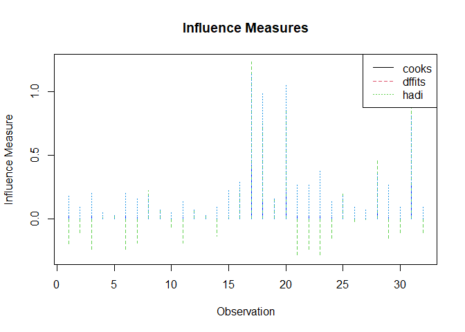
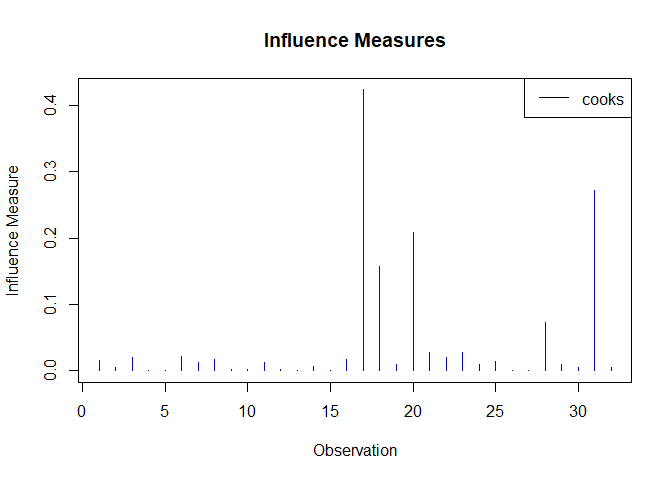

<!-- README.md is generated from README.Rmd. Please edit that file -->

# D3MINFL

<!-- badges: start -->
<!-- badges: end -->

This package provides tools for performing diagnostic analysis on linear
regression models. It includes functions to compute and plot various
influence measures such as Cook’s Distance, DFFITS, and Hadi’s Influence
Measure.

## Installation

You can install the development version of D3MINFL from
[GitHub](https://github.com/purunnz/D3MINFL) with:

``` r
# install.packages("devtools")
devtools::install_github("purunnz/D3MINFL")
```

## Example

This is a basic example which shows you how to solve a common problem:

``` r
library(D3MINFL)
## basic example code
```

This function calculates influence measures for a given linear model.
The user can select which measure to calculate: Cook’s Distance, DFFITS,
or Hadi’s Influence Measure.:

``` r
model <- lm(mpg ~ wt + hp, data = mtcars)
influence_values <- calculate_influence_measures(mtcars, model, measure = "cooks")
print(influence_values)
#>           Mazda RX4       Mazda RX4 Wag          Datsun 710      Hornet 4 Drive 
#>        1.589652e-02        5.464779e-03        2.070651e-02        4.724822e-05 
#>   Hornet Sportabout             Valiant          Duster 360           Merc 240D 
#>        2.736184e-04        2.155064e-02        1.255218e-02        1.677650e-02 
#>            Merc 230            Merc 280           Merc 280C          Merc 450SE 
#>        2.188702e-03        1.554996e-03        1.215737e-02        1.423008e-03 
#>          Merc 450SL         Merc 450SLC  Cadillac Fleetwood Lincoln Continental 
#>        1.458960e-04        6.266049e-03        2.786686e-05        1.780910e-02 
#>   Chrysler Imperial            Fiat 128         Honda Civic      Toyota Corolla 
#>        4.236109e-01        1.574263e-01        9.371446e-03        2.083933e-01 
#>       Toyota Corona    Dodge Challenger         AMC Javelin          Camaro Z28 
#>        2.791982e-02        2.087419e-02        2.751510e-02        9.943527e-03 
#>    Pontiac Firebird           Fiat X1-9       Porsche 914-2        Lotus Europa 
#>        1.443199e-02        5.920440e-04        5.674986e-06        7.353985e-02 
#>      Ford Pantera L        Ferrari Dino       Maserati Bora          Volvo 142E 
#>        8.919701e-03        5.732672e-03        2.720397e-01        5.600804e-03
```

This function plots the selected influence measures for a given linear
model. It combines Cook’s Distance, DFFITS, and Hadi’s Influence Measure
in one plot.:


